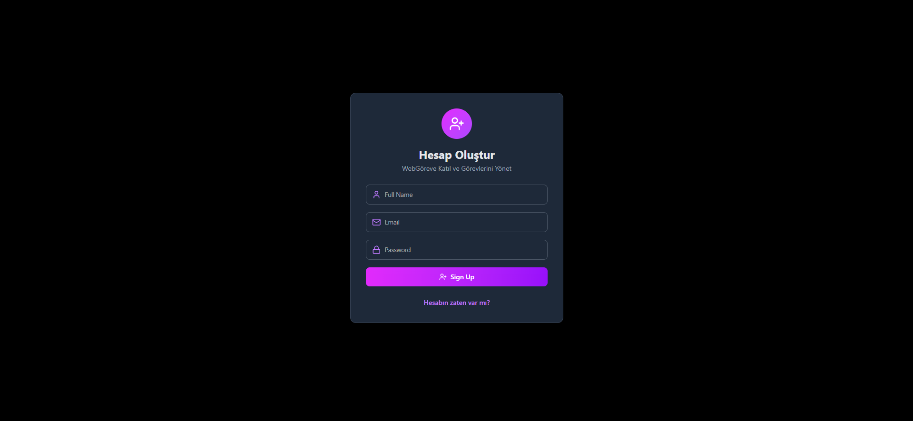
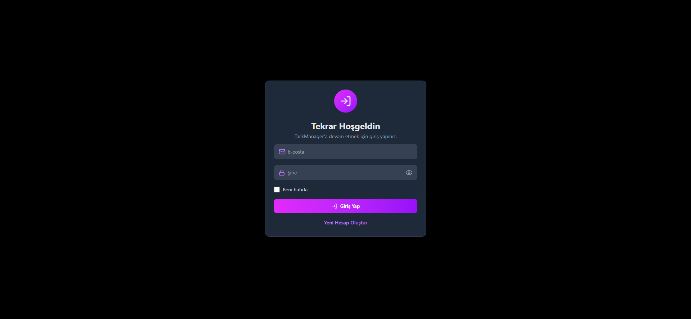
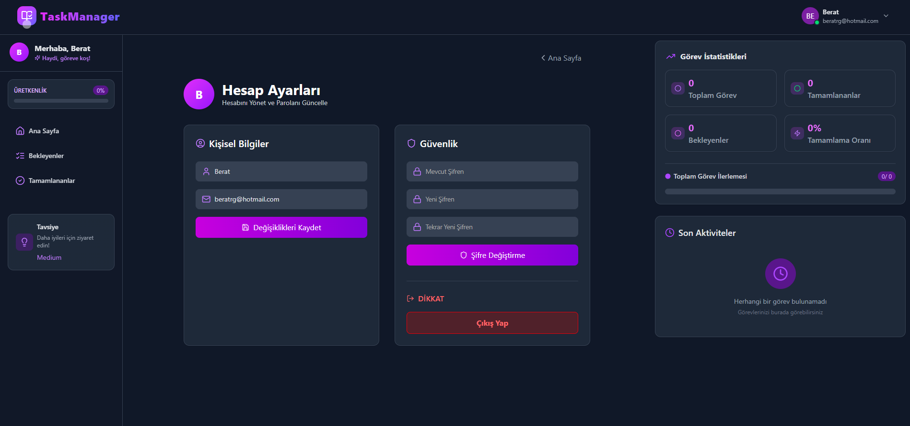
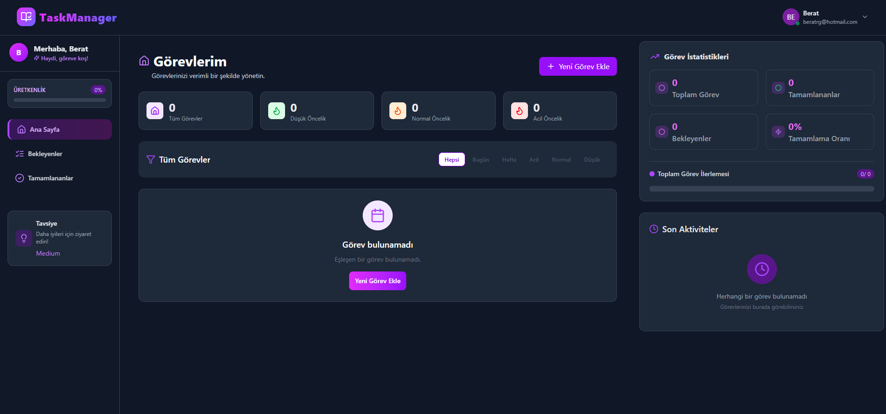
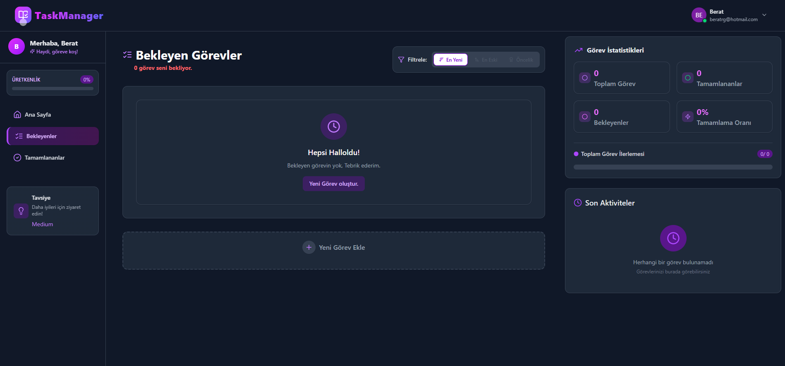
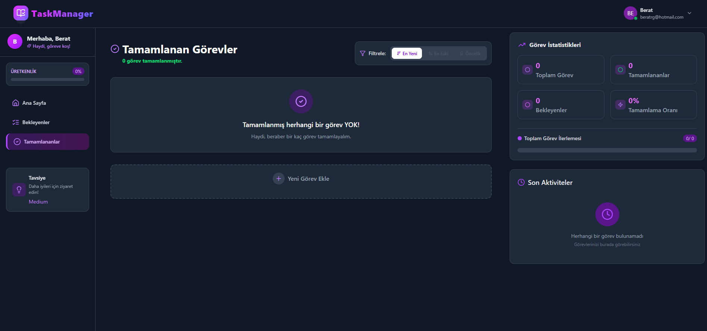

# TaskManager - Task Management Application

TaskManager is a modern and user-friendly task management application developed with React and Node.js.

## Features

- 🔐 User Authentication (Register/Login)
- 📝 Create and Edit Tasks
- 🏷️ Categorize Tasks by Priority Levels
- 📅 Set Due Dates for Tasks
- ✅ Mark Tasks as Completed
- 📱 Responsive Design

## Technologies

### Frontend
- React.js
- Tailwind CSS
- React Router
- Axios
- Lucide Icons
- React Toastify

### Backend
- Node.js
- Express.js
- MongoDB
- JWT Authentication
- Bcrypt


🔐 Register Page



🔓 Login Page



🧑‍💼 Profile Page



📊 Dashboard



📋 Pending Tasks



✅ Completed Tasks




## Installation

1. Clone the project:
```bash
git clone https://github.com/berat-karaa/TaskManager.git
cd TaskManager
```

2. Install backend dependencies:
```bash
cd backend
npm install
```

3. Install frontend dependencies:
```bash
cd ../frontend
npm install
```

4. Create .env file for backend:
```env
PORT=4000
MONGODB_URI=mongodb://localhost:27017/taskmanager
JWT_SECRET=your_jwt_secret
```

5. Start the application:

For backend:
```bash
cd backend
npm start
```

For frontend:
```bash
cd frontend
npm run dev
```

## Project Structure

```
TaskManager/
├── backend/
│   ├── routes/         # API endpoints and route handlers
│   ├── models/         # Database models and schemas
│   ├── controllers/    # Business logic controllers
│   ├── middleware/     # Middleware functions (auth, validation)
│   ├── config/         # Configuration files
│   ├── node_modules/   # Node.js dependencies
│   ├── server.js       # Main server file
│   ├── package.json    # Node.js project configuration
│   └── package-lock.json # Dependency lock file
│
├── frontend/
│   ├── src/           # Source code files
│   │   ├── components/  # React components
│   │   ├── pages/      # Page components
│   │   ├── services/   # API services
│   │   ├── utils/      # Utility functions
│   │   ├── styles/     # CSS/SCSS files
│   │   └── App.js      # Main React component
│   ├── public/        # Static assets
│   ├── node_modules/  # Node.js dependencies
│   ├── index.html     # Main HTML file
│   ├── tailwind.config.js # Tailwind CSS configuration
│   ├── package.json   # Node.js project configuration
│   ├── package-lock.json # Dependency lock file
│   ├── vite.config.js # Vite build configuration
│   ├── eslint.config.js # ESLint configuration
│   └── README.md      # Frontend documentation
│
├── requirements.txt   # Python backend dependencies
├── README.md         # Project documentation
├── LICENSE          # MIT License file
└── .gitignore      # Git ignore rules
```

> **Note:** Make sure your MongoDB server is running and accessible.  
> If you're using MongoDB Atlas or a remote database, update the `MONGODB_URI` accordingly.

## Contributing

1. Fork this repository
2. Create your feature branch (`git checkout -b feature/amazing-feature`)
3. Commit your changes (`git commit -m 'Add some amazing feature'`)
4. Push to the branch (`git push origin feature/amazing-feature`)
5. Open a Pull Request

## License

This project is licensed under the MIT License - see the [LICENSE](LICENSE) file for details.

## Contact

Project Owner - [@berat-karaa](https://github.com/berat-karaa)

Project Link: [https://github.com/berat-karaa/TaskManager](https://github.com/berat-karaa/TaskManager) 
